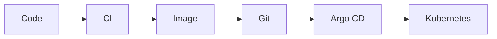

# GitOps Cloud Lab

A local-first DevOps lab that moves one small FastAPI service through a complete
GitOps delivery loop. The application is deliberately simple; the useful part
is the traceable path from code to Kubernetes.

> **Why I built it:** I wanted to prove the delivery chain without a cloud bill
> or a hidden deploy button. Every environment change remains visible in Git.

## Delivery flow



One application push starts **3 GitHub Actions workflows**:

1. `CI` runs **4 pytest tests**.
2. `Build and push image` publishes
   `ghcr.io/lotoos0/demo-api:sha-<7-character-commit>`.
3. `GitOps update` changes exactly **1 field** in dev values: `image.tag`.

Argo CD then reconciles the shared Helm chart into **2 environments**:

| Environment | Application     | Namespace       | Delivery rule                           |
| ----------- | --------------- | --------------- | --------------------------------------- |
| dev         | `demo-api-dev`  | `demo-api`      | automatic after successful CI and build |
| prod        | `demo-api-prod` | `demo-api-prod` | manual PR-based promotion               |

CI publishes artifacts but does not deploy to the cluster. Git holds the desired
state; Argo CD syncs the cluster to match Git.

## Stack

| Tool           | Role                                  |
| -------------- | ------------------------------------- |
| kind           | disposable local Kubernetes cluster   |
| GitHub Actions | tests, image build and dev tag update |
| Docker + GHCR  | immutable image artifact              |
| Helm           | one chart shared by dev and prod      |
| Argo CD        | reconciliation and drift correction   |
| Terraform      | records the local IaC boundary        |

## Quick start

Install Docker, kind, kubectl and Make, then run:

```bash
make bootstrap
```

The target performs **5 operations**: create the cluster, patch CoreDNS,
install Argo CD, apply both Applications and print verification data. Wait
until both Applications report `Synced` and `Healthy`:

```bash
kubectl get applications -n argocd -w
```

Both Applications should converge to `Synced` and `Healthy`. Endpoint checks,
promotion, rollback and known failure modes are covered in the documents below.

## Repository map

```text
apps/demo-api/         FastAPI service: 3 endpoints and 4 tests
deploy/helm/demo-api/  shared Deployment and Service templates
gitops/envs/           dev and prod desired-state values
gitops/apps/           2 Argo CD Application manifests
infra/local/           local IaC skeleton and CoreDNS repair script
.github/workflows/     3-stage delivery pipeline
docs/                  architecture, operations and troubleshooting
```

## Documentation

- [Architecture](docs/ARCHITECTURE.md) explains the flow and design decisions.
- [Runbook](docs/RUNBOOK.md) covers bootstrap, dev delivery, prod promotion and
  rollback.
- [Troubleshooting](docs/TROUBLESHOOTING.md) contains the known local failure
  modes and fixes.

## Scope

The lab is complete within these boundaries:

- one local kind cluster rather than cloud infrastructure;
- no metrics or monitoring stack;
- no Argo CD Image Updater — selected tags remain explicit Git changes;
- no enforced branch protection — the prod PR is a documented human control.

Small scope is the point. This repository demonstrates one delivery loop, not a
platform team hiding in a trench coat.
