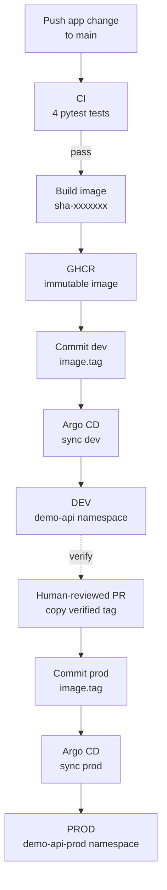

# Architecture

Git is the desired-state ledger for this lab. GitHub Actions creates and records
an artifact; Argo CD reads that record and reconciles Kubernetes. CI therefore
needs no cluster credentials and issues no direct deployment command.

> **Design principle:** every hand-off should be visible: test result, image
> tag, Git change and cluster state. Hidden automation is convenient right up
> to the moment somebody has to explain it.

## Overview

The normal path has **3 workflows**, **1 image**, **2 values files**, **2 Argo
CD Applications** and **2 namespaces**. Dev updates automatically; prod receives
the same verified tag through a human-reviewed PR.

## Components

| Component | Responsibility |
| --- | --- |
| `apps/demo-api` | FastAPI service with 3 endpoints and 4 tests |
| GitHub Actions | test, build and commit the dev image tag |
| GHCR | store `demo-api:sha-<7-character-commit>` images |
| Git | hold the dev and prod desired state |
| Helm | render one shared Deployment and Service definition |
| Argo CD | reconcile Git into the two Kubernetes namespaces |

Both Applications track `main` and use `deploy/helm/demo-api`. Environment
separation comes from values and namespaces, not duplicated charts:

| Environment | Values | Application | Namespace |
| --- | --- | --- | --- |
| dev | `gitops/envs/dev/values.yaml` | `demo-api-dev` | `demo-api` |
| prod | `gitops/envs/prod/values.yaml` | `demo-api-prod` | `demo-api-prod` |

## Delivery

### Development

A push under `apps/demo-api/**` starts `CI`. Four passing tests trigger the image
build for the exact tested commit. After GHCR receives the image,
`gitops-update.yml` changes only `image.tag` in dev values and commits it to
`main`.

Argo CD renders the shared chart and updates the dev workload. Automated sync,
pruning, self-healing and namespace creation are enabled, so manual cluster
changes are treated as drift.

### Production

Production does not rebuild the application and does not follow dev
automatically. A human copies a tag already verified in dev to prod values
through a PR. After merge, Argo CD deploys that same artifact to
`demo-api-prod`.

This separates two decisions: automation proves that the image can be built and
run; a person decides when the verified image should reach prod.

## Pipeline safety

Three controls keep delivery and rollback from racing each other:

1. `ci.yml` runs only when `apps/demo-api/**` changes. A values-only rollback
   starts **0 new CI runs**.
2. `image-build.yml` uses `cancel-in-progress: false`, so an active registry
   push finishes instead of leaving a partial hand-off.
3. `gitops-update.yml` uses `cancel-in-progress: true`, so a newer desired-state
   update may replace stale pending work.

The two downstream workflows use `workflow_run` and proceed only after upstream
success. A failed test creates no image; a failed build creates no tag update.

The bot requires `contents: write` to update dev values directly on `main`.
Enforced branch protection would require a GitHub App token or a PR-based dev
update; neither is part of this lab.

## Design decisions

| Decision | Why | Trade-off |
| --- | --- | --- |
| single-node kind cluster | fast, local and close to the Kubernetes API used in CI | not a production control plane |
| SHA-based image tags | tie the deployed artifact to one source commit | tags remain a project convention rather than registry-enforced immutability |
| GitHub Actions updates dev values | every selected tag becomes an auditable Git change | bot needs repository write access |
| Argo CD owns deployment | CI stays outside the cluster and drift is corrected | Git polling can add about 3 minutes |
| one chart, two values files | avoids duplicated templates while separating environments | both environments share chart changes |
| PR-based prod promotion | promotes the tested artifact with a human audit trail | the gate is procedural without branch protection |

I chose explicit Git tag updates instead of Argo CD Image Updater because the
repository is a teaching lab: the useful proof is the commit that says exactly
what should run. Less magic, more receipts.
