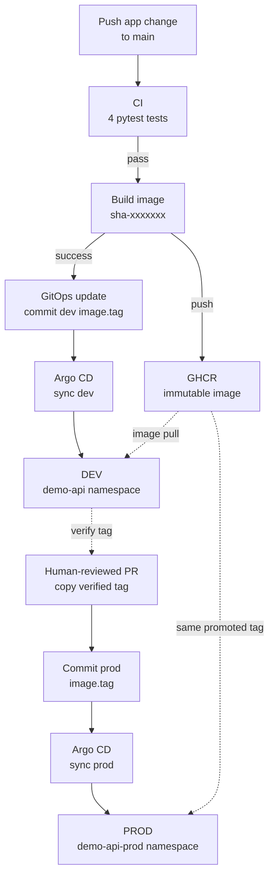
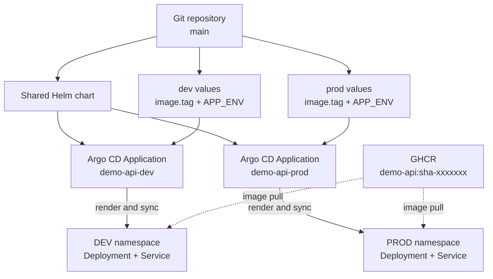

# Architecture

This lab uses Git as the desired-state ledger and Argo CD as the reconciler
that keeps the cluster aligned with it. The application is intentionally small;
the delivery path is the system being demonstrated. In other words, the API is
the passenger here — the pipeline is driving.

> **A note from me:** I deliberately kept the application boring enough to
> understand in a few minutes. That leaves the interesting parts — artifact
> identity, promotion, reconciliation and rollback — visible instead of buried
> under business logic.

The design separates two concerns:

1. GitHub Actions tests the code, builds one immutable image and records its tag
   in Git.
2. Argo CD reads the desired state from Git and reconciles Kubernetes without a
   direct deployment command from CI.

This split is intentional. CI proves and publishes an artifact; Git records
which artifact should run; Argo CD handles the cluster. Each hand-off is visible
and can be inspected later, which is much more useful than a pipeline step
quietly waving `kubectl` at production.

## Delivery overview



The normal delivery path contains **3 workflows**, **1 immutable image
artifact**, **2 desired-state files**, **2 Argo CD Applications** and **2
namespaces**. It contains **0 direct deployment commands from CI**.

Those numbers are small on purpose. Three workflows make the test, build and
desired-state update boundaries explicit. Two values files and two Applications
provide dev/prod separation without creating two copies of the Helm chart.

## Runtime topology



The first diagram answers **how a commit reaches an environment**. The second
answers **what Argo CD combines at runtime**: one chart, one environment-specific
values file and one immutable image. Keeping those views separate makes both
the delivery sequence and the cluster layout readable without diagram yoga.

## Delivery paths

### Development

1. A change under `apps/demo-api/**` is pushed to `main`.
2. The `CI` workflow runs the four API tests.
3. A successful CI run triggers `Build and push image` for the exact tested
   commit.
4. The workflow publishes
   `ghcr.io/lotoos0/demo-api:sha-<7-character-commit>` to GHCR.
5. A successful image build triggers `GitOps update`, which changes only
   `image.tag` in `gitops/envs/dev/values.yaml` and commits the result to
   `main`.
6. Argo CD detects the new desired state, renders the shared Helm chart and
   updates the `demo-api` namespace.

The `workflow_run` conditions make each stage dependent on the successful
completion of the previous one. A failed test or image build therefore stops
the chain before the desired state changes. That gives the lab **2 technical
gates before the dev desired state may change**: tests must pass, then the image
must build and reach GHCR. The third workflow records the resulting tag in Git.

> **Why I built it this way:** separate workflows leave three readable runs in
> GitHub Actions. It is slightly more ceremony than one large YAML file, but it
> makes failures and hand-offs obvious — and debugging benefits from fewer
> detective novels.

### Production

Production does not follow the automatic dev tag update. A human-reviewed
promotion PR copies a tag already verified in dev to
`gitops/envs/prod/values.yaml`. After the PR is merged, Argo CD reconciles the
`demo-api-prod` Application using the same Helm chart and immutable image.

The promotion moves an existing artifact; it does not rebuild the application.
Dev and prod therefore refer to the same image digest for a promoted tag.

> **My rule for production:** promote what was tested; do not rebuild something
> that merely looks similar. One verified tag crosses the environment boundary,
> while the production decision stays human and reviewable.

## Components and ownership

| Component | Owns | Does not own |
| --- | --- | --- |
| `apps/demo-api` | three HTTP endpoints and four tests | deployment decisions |
| `.github/workflows/ci.yml` | application test gate | image publication or deployment |
| `.github/workflows/image-build.yml` | immutable image creation and publication | desired cluster state |
| `.github/workflows/gitops-update.yml` | automatic dev tag update in Git | production promotion |
| `deploy/helm/demo-api` | shared Kubernetes `Deployment` and `Service` templates | environment-specific image tags |
| `gitops/envs/dev/values.yaml` | automatic dev desired state | production state |
| `gitops/envs/prod/values.yaml` | human-approved production desired state | image building |
| `gitops/apps/demo-api-*.yaml` | Argo CD source, destination and sync policy | source compilation |
| `infra/local` | local bootstrap support and Terraform boundary | cloud infrastructure |

## Environment model

Both Argo CD Applications track `main` and render the same Helm chart. Their
values files and target namespaces provide the environment separation:

| Environment | Values file | Argo CD Application | Namespace | Change control |
| --- | --- | --- | --- | --- |
| dev | `gitops/envs/dev/values.yaml` | `demo-api-dev` | `demo-api` | automatic after successful CI and image build |
| prod | `gitops/envs/prod/values.yaml` | `demo-api-prod` | `demo-api-prod` | human-reviewed promotion PR |

This avoids duplicating the chart while keeping the deployed tags and runtime
`APP_ENV` values independent. The result is **1 chart with 2 configurations**,
not two almost-identical charts waiting to disagree on a Friday afternoon.

## Reconciliation and drift

Both Applications enable automated sync with pruning, self-healing and
namespace creation. The control point is therefore **how the desired state
enters Git**:

- dev changes automatically after every successful delivery chain;
- prod changes only after an explicit, reviewed promotion;
- Argo CD continuously makes cluster state converge on the committed state;
- manual cluster changes are drift and are reverted by self-healing.

Argo CD polls the repository, so reconciliation can take about three minutes.
CI does not need cluster credentials and does not call `kubectl apply` or
`helm upgrade` in the normal delivery path.

That separation reduces the blast radius of CI credentials: GitHub Actions can
write the dev tag to this repository and publish the image, but it does not need
permission to mutate the cluster directly. Git remains the reviewable contract
between delivery automation and runtime state.

## Rollback model

A rollback is a new Git commit that restores the previous desired image tag:

```bash
git log --oneline gitops/envs/dev/values.yaml
git revert <bad-gitops-commit> --no-edit
git push
```

For production, use `gitops/envs/prod/values.yaml`. Argo CD detects the revert
and reconciles the workload to the earlier immutable image. This preserves the
audit trail and avoids an imperative change that the reconciler would later
undo.

> **A note from me:** rollback is intentionally unexciting. It is one revert
> commit, one previous immutable tag and the same reconciliation path used for a
> normal deployment. Boring recovery procedures are a feature.

## Deliberate boundaries

| Not included | Decision |
| --- | --- |
| AWS infrastructure | outside this local-first lab |
| metrics and monitoring | outside the delivery scope |
| Argo CD Image Updater | excluded so every selected tag remains an explicit Git change |
| enforced branch protection | not enabled; documented PR discipline is the current control |

These are design boundaries rather than unfinished implementation work. I kept
them explicit because a useful architecture document should say where the
system ends, not leave a cloud-shaped ellipsis at the bottom of the page.
